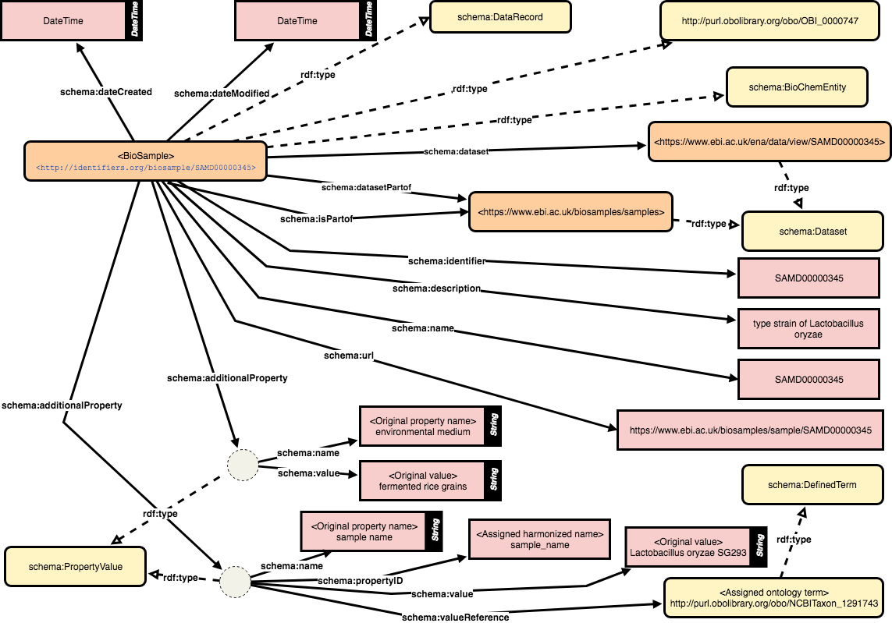

# BioSample records in JSON-LD

BioSample is a database that collects information of biological samples. BioSample is maintained by the [INSDC](http://www.insdc.org), while each member of INSDC accepts submissions and provide data access via web interface. The BioSample records submitted to the repository is published in XML format, while the EBI BioSamples database offers RESTful API to get BioSample records in JSON format.

To connect the BioSample records with different biological information sources, this repo provides a linked data model and code to convert to JSON-LD.

## Scheme



## How to use code

```
$ git clone https://github.com/inutano/biosample_jsonld
$ docker-compose up
```

## History

- EBI BioSamples started to provide [BioSample RDF](https://www.ebi.ac.uk/rdf/services/biosamples/sparql)
- Discussion at [NBDC/DBCLS BioHackathon 2017](http://2017.biohackathon.org) to improve the BioSample RDF model
- Discussion at [Elixir BioHackathon 2018 Paris](https://bh2018paris.info) to align the model of BioSamples bioschemes and BioSample RDF
